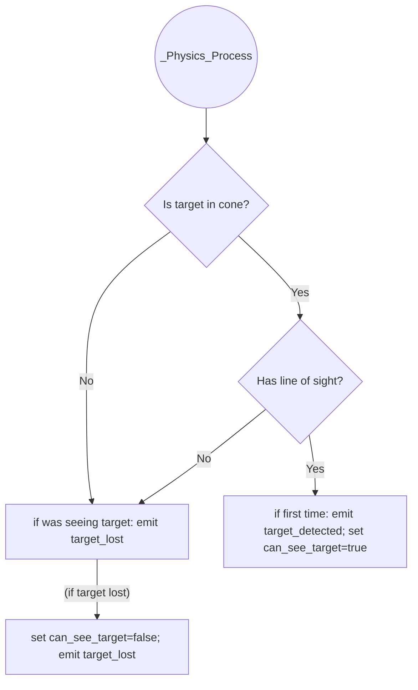

# VisionComponent

VisionComponent is a Godot `Node2D` that provides a configurable vision cone to detect targets (e.g. player or other NPCs) within range and line of sight. It is ideal for AI entities like enemies, guards, or turrets that must “see” and track targets in 2D games. Under the hood it uses a **RayCast2D** to perform line-of-sight checks. When a target enters or leaves the cone (and is visible), the component emits `target_detected` or `target_lost` signals. VisionComponent supports single or multiple target modes, automatic tracking of the detected target, and optional debug visualization. 

**Use cases:** Enemy AI that sees and follows the player, security cameras or turrets that automatically aim at visible targets, and NPCs that only react to players within their view cone. Its built-in signals and methods let you easily script reactions when targets appear or disappear. 

## Features

- **Configurable vision cone:** You can set the *angle* (degrees) and *range* (pixels) of the vision cone to control how wide and far the entity can see.
- **Single/Multiple target modes:** In *SINGLE* mode, it tracks one target from a named group. In *MULTIPLE* mode, it scans several groups and automatically picks the closest visible target.
- **Automatic target tracking:** If enabled, the component’s forward direction will rotate to follow the currently visible target (while visible).
- **Line-of-sight validation:** Uses `RayCast2D` to ensure the target is not occluded by obstacles. `RayCast2D` constantly checks for collisions along its length.
- **Debug drawing:** When **Debug Mode** is on, it draws the vision cone (lines and arc) and origin point in the editor and at runtime, using the chosen debug color.
- **Signals:** Emits `target_detected(Node2D target)` when a target becomes visible, and `target_lost(Node2D target)` when it’s no longer visible.
- **Events:** You can connect to these signals in code to handle detection and loss events (see below for examples).

## Installation & Scene Setup

1. **Attach the script:** Add a `Node2D` (or any suitable Node) to your scene and attach the VisionComponent script to it. You can also use the “Class Name” to add it via the Node creation dialog.
2. **Add a RayCast2D:** As a child of the VisionComponent node, add a `RayCast2D`. In the Inspector, assign this `RayCast2D` to the **Ray Cast** property of VisionComponent (or drag it into the `ray_cast` export). The RayCast should be enabled (default) and set to the appropriate length (e.g. same as VisionComponent length).
3. **Configure groups:**
   - If using **SINGLE** mode, set **Target Group** to the name of the group containing your target(s) (e.g. `"Player"`). Only the first node found in this group will be considered.
   - If using **MULTIPLE** mode, add group names to **Target Groups** (array of strings). VisionComponent will consider all nodes in those groups.
   - Ensure your target nodes are added to the specified groups (via the Scene dock or code with `add_to_group()`).
4. **Position and direction:** Place the VisionComponent node where the “eye” or origin of detection should be, and set its **Direction** vector (defaults to `Vector2.RIGHT`) to the forward-facing direction of the cone.
5. **Adjust properties:** In the Inspector, tweak **Angle**, **Length**, and other exports as needed (see Properties below).
6. **Connect signals (optional):** To react in code, connect the `target_detected` and `target_lost` signals, either via the editor or by code. For example:

   ```gdscript
   func _ready() -> void:
       vision = $VisionComponent
       vision.target_detected.connect(_on_target_detected)
       vision.target_lost.connect(_on_target_lost)
   ```

Editor tips: The component will show warnings if misconfigured – for example, leaving the **Ray Cast** property empty or forgetting to assign target groups will trigger errors in the Output or Inspector (see *Editor Warnings* section). 

## Properties

VisionComponent exposes several exported properties. Here is a summary of each:

| Property       | Type               | Default               | Range / Notes                                     |
| -------------- | ------------------ | --------------------- | ------------------------------------------------- |
| **angle**      | `float` (degrees)  | `90.0`                | Vision cone total angle. Slider range 30–180 (clamped to 10–360 in code). |
| **length**     | `float` (pixels)   | `100.0`               | Maximum detection distance. Slider range 50–500.   |
| **target_mode**| `TargetMode` enum  | `SINGLE`              | `SINGLE` or `MULTIPLE`. Mode of target searching. |
| **target_group**| `StringName`      | `""` (empty)         | Name of group to search (SINGLE mode only).      |
| **target_groups**| `Array[StringName]`| `[]` (empty)        | List of group names (MULTIPLE mode only).         |
| **track_target**| `bool`            | `true`                | If `true`, auto-rotates vision direction to face current target. |
| **debug_mode** | `bool`             | `false`               | When `true`, draws the vision cone (editor and runtime). |
| **debug_color**| `Color`            | `Color(0.25, 0, 0, 1)` (Dark Red) | Color used to draw the vision debug shapes.          |
| **direction**  | `Vector2`          | `Vector2.RIGHT`       | Initial forward direction of the cone. This will be normalized and reset after tracking. |
| **ray_cast**   | `RayCast2D`        | `null`                | *Required.* The RayCast2D node used for line-of-sight checks (must be assigned). |

- The **angle** setter clamps values between 10° and 360° for safety. Use the property to widen or narrow the cone.  
- **length** is the maximum distance of detection. Targets farther than this are ignored.  
- **target_mode:** In *SINGLE* mode, only `target_group` is used; in *MULTIPLE*, use `target_groups` (single mode hides the multiple field in the editor).  
- **track_target:** With this on, the VisionComponent’s `direction` vector will smoothly rotate each frame toward the visible target (using `to_local` transformation). Otherwise, the cone stays fixed at the original direction.  
- **debug_mode & debug_color:** When debugging, the script draws two lines and an arc showing the cone. This helps visualize the angle and range.  
- **direction:** Set this vector to orient the cone (default points right). It is normalized internally. The original direction is stored to restore when tracking ends.  
- **ray_cast:** Assign your RayCast2D node here. VisionComponent will set `ray_cast.target_position` each check, and call `ray_cast.force_raycast_update()` to get collision results. 

## Signals and Events

VisionComponent emits these signals:

- `signal target_detected(target: Node2D)`: Emitted when **a target enters the vision cone AND is not occluded**. The `target` parameter is the Node2D instance that was detected.  
- `signal target_lost(target: Node2D)`: Emitted when **the current target can no longer be seen** (either left the cone or became occluded). The `target` is the one that was being tracked.

**Example of connecting signals in GDScript:**

```gdscript
onready var vision: VisionComponent = $VisionComponent

func _ready():
    vision.target_detected.connect(_on_target_detected)
    vision.target_lost.connect(_on_target_lost)

func _on_target_detected(target: Node2D) -> void:
    print("Target detected: ", target.name)

func _on_target_lost(target: Node2D) -> void:
    print("Target lost: ", target.name)
```

By convention callback names start with `_on_`. Here we simply print the target’s name, but you could trigger an alert, start chasing, etc. See Godot’s [Signals documentation][18] for more on connecting signals by code.

## Methods

All of the following methods are `public` (available from code) and pertain to detection logic:

- **`is_in_cone(node: Node2D) -> bool`**  
  Checks if the given `node` is within the vision cone (ignores occlusion). It transforms the target’s global position into local space (`to_local`), then checks distance <= `length` and angle difference ≤ half the cone angle. Returns `true` if inside the cone.  
  **Example:**  
  ```gdscript
  if vision.is_in_cone(enemy):
      print("Enemy is within vision angle")
  ```

- **`has_line_of_sight(node: Node2D) -> bool`**  
  Checks for an unobstructed path from the VisionComponent to the `node`. It sets the `RayCast2D.target_position` to the local coordinates of `node.global_position`, then calls `force_raycast_update()` to immediately compute collisions. Returns `true` if the ray’s `get_collider()` is the `node` itself.  
  **Example:**  
  ```gdscript
  if vision.has_line_of_sight(player):
      print("Player is visible with no obstacles")
  ```

- **`can_see(node: Node2D) -> bool`**  
  Returns `true` if the component can currently see the `node` (it is in cone **and** has line of sight) and the node is still valid in the scene.  
  ```gdscript
  if vision.can_see(enemy):
      enemy_do_something()
  ```

- **`get_target() -> Node2D`**  
  Returns the current detected target (`Node2D`), or `null` if none. This is the target that triggered the last `target_detected` and hasn’t yet caused a `target_lost`. Useful to query who is currently tracked.  
  ```gdscript
  var current = vision.get_target()
  if current:
      print("Looking at: ", current.name)
  ```

- **`get_targets() -> Array[Node2D]`**  
  In *MULTIPLE* mode, returns an array of all possible targets (Node2D instances) gathered from all groups in `target_groups`. In *SINGLE* mode, this is not used (will error if empty). It calls `get_tree().get_nodes_in_group(group)` for each group and collects Node2Ds.  
  ```gdscript
  var all_targets = vision.get_targets()
  print("All targets in groups: ", all_targets)
  ```

- **`get_visible_targets() -> Array[Node2D]`**  
  Returns an array of all targets (from `get_targets()`) that satisfy `can_see(target)`. That is, all currently visible targets in the configured groups.  
  ```gdscript
  for target in vision.get_visible_targets():
      print("Visible: ", target.name)
  ```

- **`get_closest_visible_target(targets: Array[Node2D]) -> Node2D`**  
  Given an array of `Node2D` targets, finds the one whose distance to `global_position` is smallest. Returns the closest target (or `null` if the list is empty). This is used internally in MULTIPLE mode to pick the nearest visible target.

- **`initialize_target()`**  
  Called in `_ready()` to set up the initial target. In *SINGLE* mode it simply takes the first node in `target_group`. In *MULTIPLE* mode it populates `visible_targets` and picks the closest as `current_target`. Normally you won’t call this manually; the script does it on start.

- **`update_single_target()`**  
  Called each physics step in SINGLE mode. It checks whether the current target is still valid. If valid and `can_see` is true and `can_see_target` was false, it emits `target_detected`. If now false and was true, it emits `target_lost`. It updates the `can_see_target` flag accordingly.  

- **`update_multiple_targets()`**  
  Called each physics step in MULTIPLE mode. It gets all visible targets and finds the closest with `get_closest_visible_target`. If this new target is different from `current_target`, it emits `target_lost` for the old one (if any) and `target_detected` for the new one (if any). This way it automatically switches to the nearest visible target.

- **`has_target() -> bool`**  
  Returns true if `current_target` is a valid reference (i.e. not null and not freed). Useful to check if any target is being tracked.  
  ```gdscript
  if vision.has_target():
      print("We have a target: ", vision.get_target().name)
  ```

All methods above are part of the class’s API. The code examples show how you might call them in your scripts.

## Usage Examples

Below are some common setups and code snippets:

### 1. Minimal SINGLE-mode Setup

```gdscript
# Scene tree:
# Enemy (KinematicBody2D or other)
#  └ VisionComponent (with RayCast2D child)

onready var vision = $VisionComponent

func _ready():
    vision.target_group = "Player"    # Look for nodes in group "Player"
    vision.track_target = true        # Rotate towards target
    vision.debug_mode = true          # Draw the vision cone for debugging

    vision.target_detected.connect(_on_target_detected)
    vision.target_lost.connect(_on_target_lost)

func _on_target_detected(target):
    print("Player has entered vision:", target.name)

func _on_target_lost(target):
    print("Player left vision:", target.name)
```

In SINGLE mode, VisionComponent will always track the first node found in the "Player" group. It emits signals when the player comes into or leaves the cone (or gets blocked).

### 2. MULTIPLE-mode (choose closest visible)

```gdscript
# Scene tree:
# Tower (Node2D)
#  └ VisionComponent (with RayCast2D child)
# Targets are enemies added to groups "MeleeEnemies", "RangedEnemies", etc.

onready var vision = $VisionComponent

func _ready():
    vision.target_mode = VisionComponent.TargetMode.MULTIPLE
    vision.target_groups = ["Melee", "Ranged"]
    vision.length = 300
    vision.debug_mode = true

    vision.target_detected.connect(_on_enemy_detected)
    vision.target_lost.connect(_on_enemy_lost)

func _on_enemy_detected(target):
    print("Acquired new target:", target.name)

func _on_enemy_lost(target):
    print("Lost target:", target.name)
```

In MULTIPLE mode, VisionComponent scans both groups ("Melee" and "Ranged"), collects all targets, and picks the closest one that is visible. It automatically switches targets if a nearer one appears.

### 3. Tracking the Target

```gdscript
# If track_target is true, VisionComponent will rotate to face the target:
vision.track_target = true

# In each frame _process(), the component’s direction will update:
# (This is automatic; you don’t need extra code.)
```

With `track_target = true`, the vision cone will follow the target. The `direction` vector is set toward the target each frame (using `to_local` and normalization), so any attached turret or character facing logic can use that.

### 4. Debug Visualization

```gdscript
vision.debug_mode = true
vision.debug_color = Color.green
vision.angle = 60
vision.length = 200
```

In this example, the vision cone is drawn in green in the editor and at runtime. You will see two boundary lines and an arc of radius `length` spanning the angle. This is useful to fine-tune angle/length.

### Scene Tree Snippet (for reference)

```
Node2D (YourCharacter or Enemy)
└─ VisionComponent (script)
   └─ RayCast2D (child of VisionComponent, enabled)
```

Ensure the `VisionComponent` node has a `RayCast2D` child, and that the `ray_cast` export is set to that child in the Inspector.

## Editor Warnings and Common Pitfalls

- **Missing RayCast2D:** If you forget to assign the `ray_cast` property, the script will print an error and disable itself. Always drag your RayCast2D node into this field.
- **Empty Group(s):** In SINGLE mode, leaving **Target Group** blank causes a runtime error. In MULTIPLE mode, leaving **Target Groups** empty does similarly. The editor will show warnings (due to `_get_configuration_warnings`) prompting you to assign them.
- **Top-Level RayCast2D:** The RayCast2D must be a child of a Node2D (e.g., not `CanvasLayer` or top-level). Otherwise `to_local` or `target_position` may not work as expected (this is a general Godot quirk).
- **Angle too small:** The minimum angle clamp is 10°, so setting below that just becomes 10°.
- **Performance tip:** The `_physics_process` checks run only on every 2nd physics frame (`if Engine.get_physics_frames() % 2 != 0: return`). This reduces CPU usage slightly without missing fast-moving targets.

## Debugging Tips & Performance

- **Physics Frame Skipping:** VisionComponent only updates on alternate physics frames, as a minor optimization. Thus it can handle fast-moving targets efficiently, but if you have extremely high-speed targets you may want to adjust this logic.
- **RayCast Updates:** By default, RayCast2D only updates once per physics frame. The code calls `force_raycast_update()` to immediately refresh the collision result when checking a target, ensuring the line-of-sight is up-to-date.
- **Checking Colliders:** If line-of-sight fails, the target might be behind an obstacle (another PhysicsBody2D or Area2D). Remember that `has_line_of_sight()` resets the RayCast2D’s target and uses `is_colliding()`.
- **Debug Visualization:** Use `debug_mode = true` during development to see exactly where the cone is and what it’s detecting. The drawn origin (circle) can help place the node correctly.

## FAQ & Defaults

**Q:** *Can VisionComponent detect multiple targets simultaneously?*  
**A:** In *SINGLE* mode it only tracks one target at a time. In *MULTIPLE* mode it considers all targets but only focuses on the closest one (you can get others via `get_visible_targets()` if needed).

**Q:** *What if I want the cone to follow the entity’s orientation?*  
**A:** You can parent VisionComponent to your character and update its `direction` or `rotation` each frame (or simply use `track_target = true` to automatically aim at the target when visible).

**Q:** *Should I use `Area2D` or `KinematicBody2D` for targets?*  
**A:** Any Node2D works, but ensure it has a CollisionObject2D (like a body or tilemap) if you want the raycast to detect it. Areas can also work if colliding with bodies.

Below is a table of default values for quick reference:

| Property        | Default           |
| --------------- | ----------------- |
| **angle**       | 90.0°             |
| **length**      | 100               |
| **target_mode** | SINGLE            |
| **track_target**| true              |
| **debug_mode**  | false             |
| **debug_color** | Dark Red (Color(0.25,0,0,1)) |
| **direction**   | Vector2.RIGHT     |



*Figure: Detection flow chart for each physics update. If a target is in the vision cone and unblocked, `target_detected` is emitted. Otherwise (if it was previously detected), `target_lost` is emitted.* 

By following this documentation and the Godot conventions, you should be able to integrate VisionComponent into your game to give your characters or objects realistic sight-based behavior. 

**Sources:** Godot Engine official documentation for RayCast2D, Node2D, SceneTree, and signals. These explain how raycasting, coordinate transforms, and node groups work under the hood.